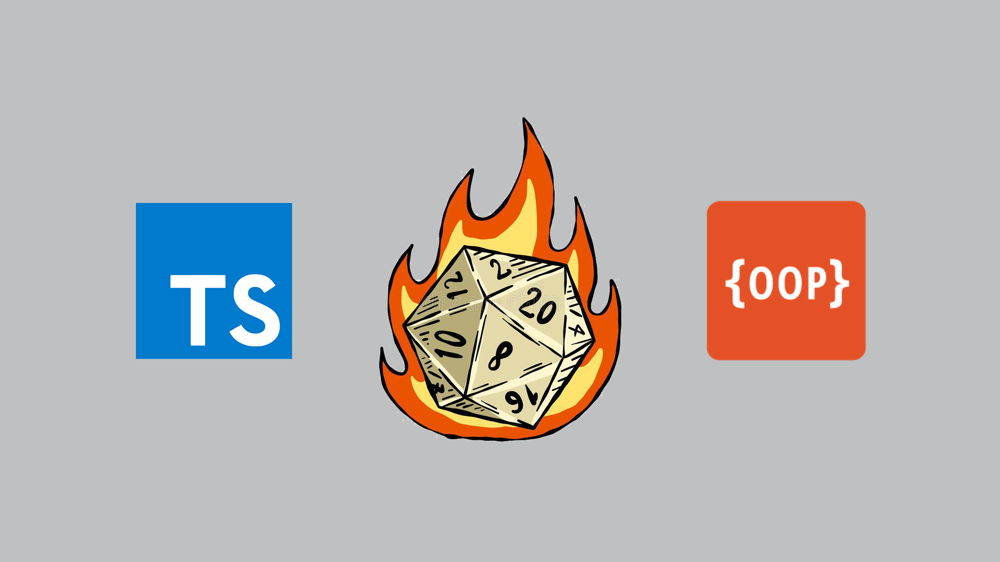

# ⚒️ Souls and Dragons

## 📡 Desenvolvimento

Projeto desenvolvido na <a href="https://betrybe.com/" target="_blank">Trybe</a> durante o módulo de Back-End!

Nesse projeto criamos e praticamos classes, interfaces e tipos utilizando os princípios de SOLID e Programação Orientada a Objetos em TypeScript.

 

## 📜 Habilidades

- Aplicar os princípios da arquitetura SOLID
- Aplicar os princípios de POO (Programação Orientada a Objetos)

 

## ⚙️ Tecnologias

- TypeScript
- SOLID
- POO (Programação Orientada a Objetos)

#

  
🍐

